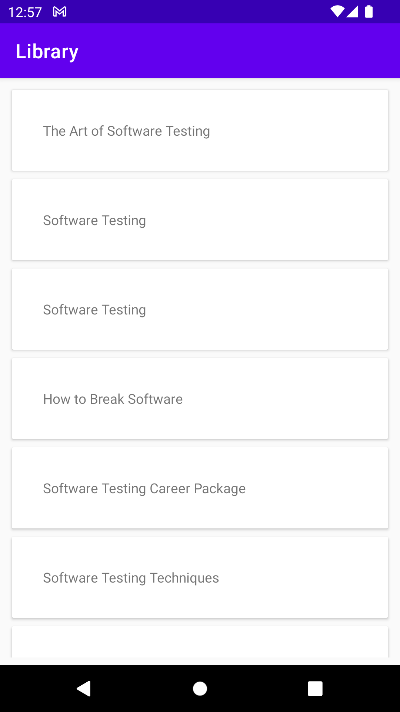
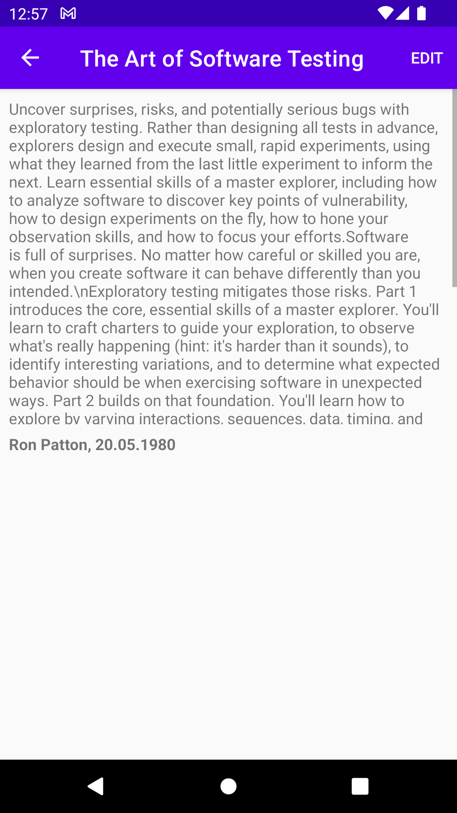
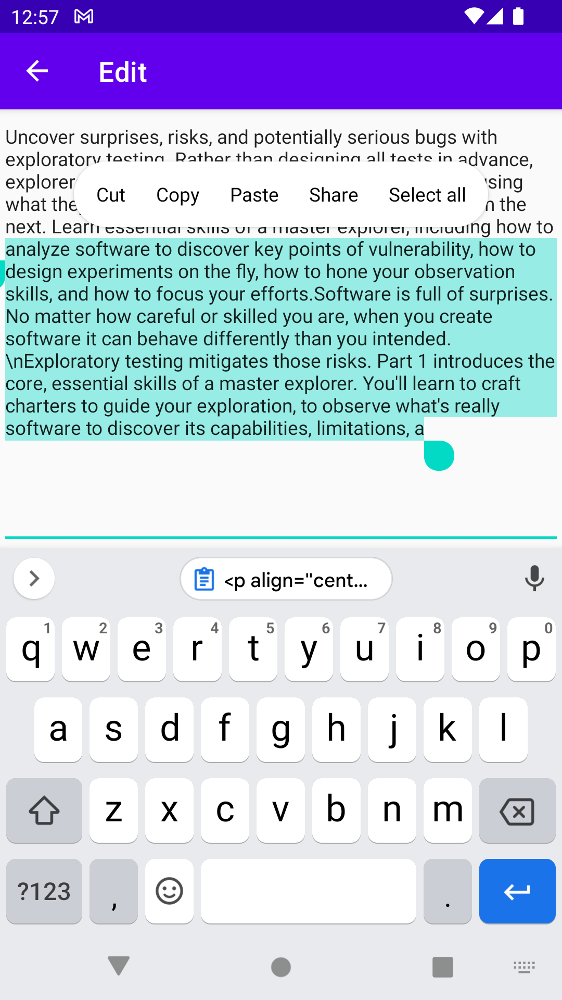

# JSC Kalashnikov Concern Test Task
Create a mobile app for the Android operating system that shows a list of books from a database. 

## Key Moments:
- App automatically displays a list of currently available books on the main screen.
- Users can edit descriptions and store changes in the local database by tapping the "Edit" option.
- App stores books in an SQLite database(Room Persistence Library).
- Write unit tests using Mockito and Junit frameworks.
- Single activity architecture using MVVM(LiveData + ViewModel)
- Jetpack Navigation component for implementing app's navigation

## Screenshots

## Contact

Maxim Smolyakov - [LinkedIn](https://linkedin.com/in/maxim-smolyakov-8945211a5)
- [Email](mailto:sm.makism@icloud.com) - [Facebook](https://www.facebook.com/merk.merklol)
